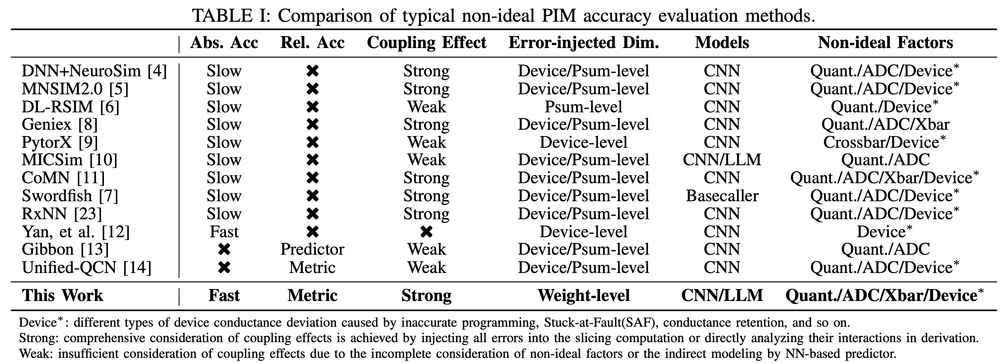
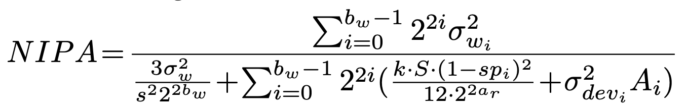

# How Do Errors Impact NN Accuracy on Non-Ideal Analog PIM? Fast Evaluation via an Error-Injected Robustness Metric [ICCAD 2025]

<p align="center">
🌐 &nbsp&nbsp📑 <a href="https://nicsefc.ee.tsinghua.edu.cn/%2Fnics_file%2Fpdf%2Fad81b36e-96d6-4a96-885e-24c6c0f8a739.pdf"><b>Paper</b></a>&nbsp&nbsp | &nbsp&nbsp🤗 <a href="https://nicsefc.ee.tsinghua.edu.cn/%2Fnics_file%2Fpdf%2F4185ec9a-4c35-459b-a281-b074b5252814.pdf"><b>PowerPoint</b></a>
</p>

In this work, we propose a non-ideal PIM accuracy (NIPA) evaluation model for relative accuracy evaluation and a non-slicing absolute accuracy evaluation method. By unifying
various errors in the weight dimension and using NN’s prior information, the proposed methods **eliminate the need for the time-consuming bit-and-crossbar slicing simulatin process** while accounting for the coupling effects among various errors.

Extensive experiments on CNNs and LLMs validate that the proposed NIPA evaluation model achieves **high correlations of up to 0.91** with the absolute accuracy evaluated by DNN+NeuroSim. At the same time, compared to existing bit-and-crossbar slicing evaluation methods, the proposed non-slicing absolute accuracy evaluation method achieves **up to 105.8x speedup with average with evaluation errors as low as 0.29%**.

---
As shown in Table I, compared to existing PIM accuracy evaluation methods, this work achieves further improvements in **evaluation efficiency, comprehensiveness, supported model, and error types.**
[]()

## 🛠️ Environment Setup

Create a new conda environment and install dependencies:

```bash
conda create -n nipa python=3.9
conda activate nipa
pip install -r requirements.txt
```

## 🚀 Usage

### Step 1. Obtain the pre-trained model
Users can train a target model using the training script, or they can directly use a pre-trained model they have previously developed and the target dataset. The training scripts of CNNs validated in this paper is shown in `pretrained.py` and `./scripts/pretrain.sh`. After training, the model ckpts need to be placed in `./ckpts`.

```bash
CUDA_VISIBLE_DEVICES=0 python pretrain.py --model_name resnet18 --dataset cifar100 --log_file ./results/resnet18/pretrain_cifar100.log
```

### Step 2. Run DNN+NeuroSim to collect the ground-truth results
In this work, the proposed accuracy evaluation methods are compared and verified with the absolute accuracy evaluated by DNN+NeuroSIM. The parameter configuration space is defined in `./HW_config/Search_space.ini`. Conducting `main.py` run three experiments for each parameter set and take the average accuracy as the ground
truth following:

```bash
CUDA_VISIBLE_DEVICES=0 python main.py --model_name efficientnetv2m --dataset cifar100 --sample_num 200 --log_file ./results/efficientnetv2m/cifar100_accsim.log --batch_size 256
```

See `./scripts/run.sh` for more example scripts.

### Step 3. Conduct statistical analysis of the model
For each layer in a given model, we separately statistic its bit-level weight
variance, sparsity, and other required information, which will be used in our accuracy evaluation tools. See `./scripts/stat.sh` for example scripts.

### Step 4-1. Relative accuracy evaluation by NIPA metric
Now we get all the statistic data we need! Let's validate the proposed NIPA emrtic!
[]()

```bash
CUDA_VISIBLE_DEVICES=0 python validate.py --model_name resnet18 --dataset cifar100
```
See `./scripts/validate.sh` for more example scripts.

### Step 4-2. Absolute accuracy evaluation
Note that the proposed tool not only supports relative accuracy evaluation, but also enables efficient absolute accuracy evaluation on the target dataset following:

```bash
CUDA_VISIBLE_DEVICES=0 python wrap_error.py --model_name mobilenetv2 --dataset cifar100 --log_file ./results/mobilenetv2/abs_cifar100_accsim.log --batch_size 256
```
See `./scripts/abs_accsim.sh` for more example scripts.